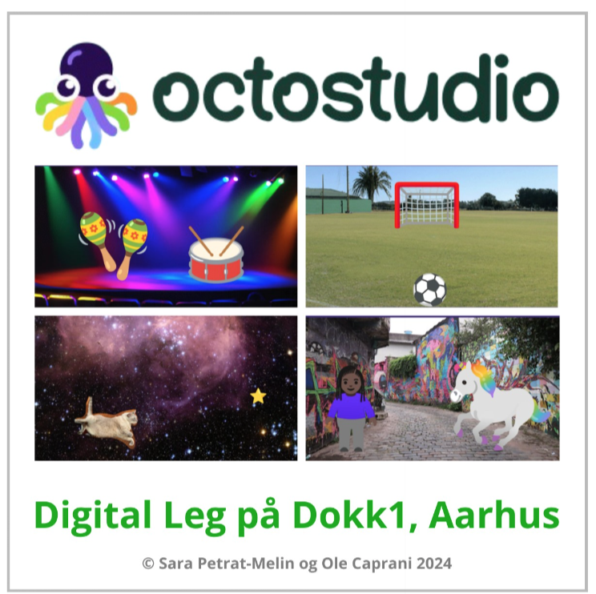
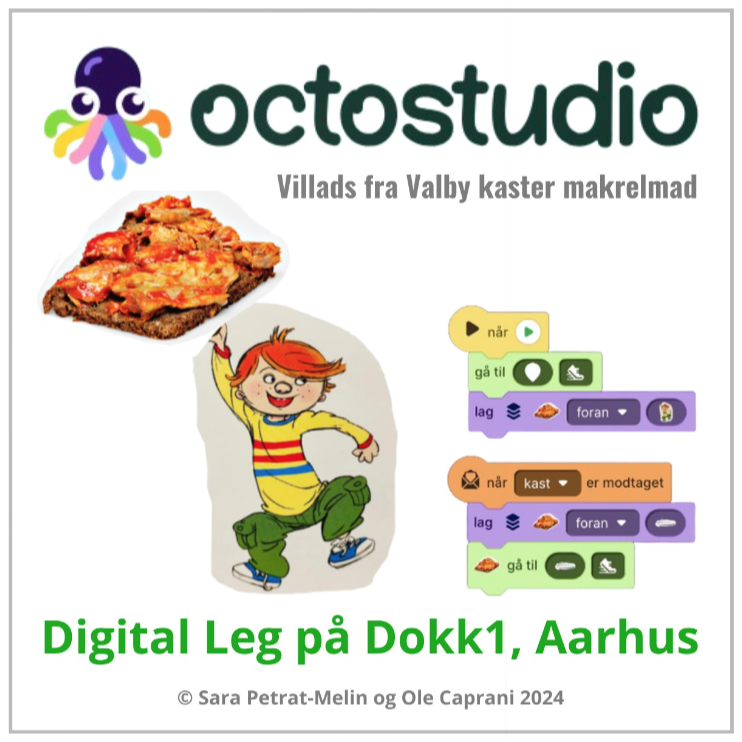

# OctoStudio
<a href="https://octostudio.org/en/" target="_blank">OctoStudio</a> er et værktøj til at skabe projekter på en mobiltelefon eller en iPad/tablet med bl. a. animerede historier eller spil. Til at animere figurer eller skabe dynamik i spil benyttes blokprogrammering. 

Nedenfor ses forsiderne af bøger om at skabe projekter i OctoStudio. 
Tryk på bogen for at læse bogen i Skoletube. Ved siden af bogens forside findes en liste af blokprogrammer brugt i bogen. Tryk på programmerne for at downloade dem til brug i 
OctoStudio App fra GooglePlay eller App Store.
<table>
  <tr>
    <td>
      
    </td>
    <td>
      <a href="https://ocaprani.github.io/OctoStudio/Jorden.octostudio" target="_blank" download>Jorden.octostudio</a> 
      <a href="https://ocaprani.github.io/OctoStudio/Larve.octostudio" target="_blank" download>Larve.octostudio</a>  
      <a href="https://ocaprani.github.io/OctoStudio/Tryllestav.octostudio" target="_blank" download>Tryllestav.octostudio</a>  
      <a href="https://ocaprani.github.io/OctoStudio/StopSpil.octostudio" target="_blank" download>StopSpil.octostudio</a>  
      <a href="https://ocaprani.github.io/OctoStudio/StjernefangerStop.octostudio" target="_blank" download>StjernefangerStop.octostudio</a>  
      <a href="https://ocaprani.github.io/OctoStudio/Spilstyrer.octostudio" target="_blank" download>Spilstyrer.octostudio</a>  
      <a href="https://ocaprani.github.io/OctoStudio/PaaSki.octostudio" target="_blank" download>PaaSki.octostudio</a>  
      <a href="https://ocaprani.github.io/OctoStudio/Musiker.octostudio" target="_blank" download>Musiker.octostudio</a>  
      <a href="https://ocaprani.github.io/OctoStudio/Frugt.octostudio" target="_blank" download>Frugt.octostudio</a>  
    </td>
  </tr>
    <tr>
    <td>
      
    </td>
    <td>
      <a href="https://ocaprani.github.io/OctoStudio/Villads/Historie starter.octostudio" target="_blank" download>Historie starter.octostudio</a>  
      <a href="https://ocaprani.github.io/OctoStudio/Villads/Halloween.octostudio" target="_blank" download>Halloween.octostudio</a>  
      <a href="https://ocaprani.github.io/OctoStudio/Villads/Kaninfanger spil.octostudio" target="_blank" download>Kaninfanger spil.octostudio</a> 
       <a href="https://ocaprani.github.io/OctoStudio/Villads/Villads scorer.octostudio" target="_blank" download>Villads scorer.octostudio</a>  
       <a href="https://ocaprani.github.io/OctoStudio/Villads/Undgaa Fridas mor.octostudio" target="_blank" download>Undgaa Fridas mor.octostudio</a>  
      <a href="https://ocaprani.github.io/OctoStudio/Villads/Makrelmad.octostudio" target="_blank" download>Makrelmad.octostudio</a>  
    </td>
  </tr>
  <tr>
    <td>
      
    </td>
    <td>
      <a href="https://ocaprani.github.io/OctoStudio/Habakuk/Bandeord.octostudio" target="_blank" download>Bandeord.octostudio</a>  
      <a href="https://ocaprani.github.io/OctoStudio/Habakuk/Styr Klokken.octostudio" target="_blank" download>Styr Klokken.octostudio</a>  
    </td>
  </tr>
</table>
