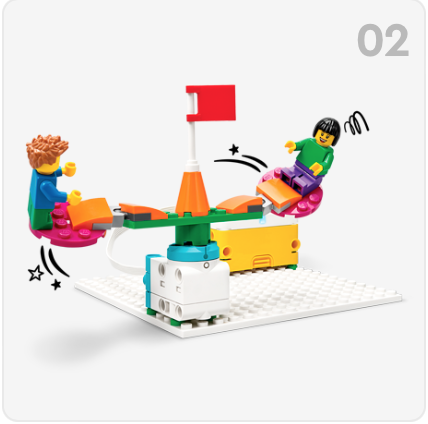
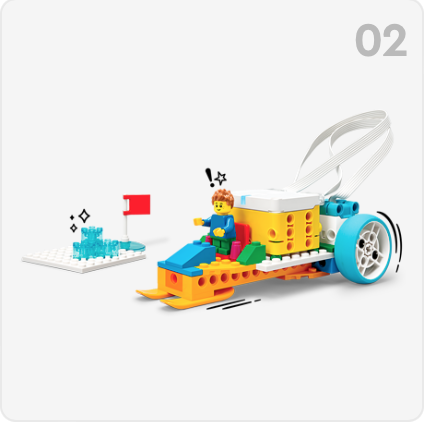

# SPIKE Essential
LEGO modeller bygget ved brug af LEGO elementerne i <a href="https://www.lego.com/da-dk/product/lego-education-spike-prime-set-45678" target="_blank">
LEGO® Education SPIKE™ Essential-sæt 45345</a> kan programeres med ikon blokke i 
<a href="https://education.lego.com/da-dk/downloads/spike-app/software/" target="_blank">SPIKE App</a>. Nogle af modellerne i SPIKE App kan også styres direkte ved at bruge en af hjemmesiderne nedenfor
<table>
  <tr>
    <td>
      </td>
      <a href="karrusel/index.html" target="_blank">Karrusel styring</a>a>
    <td>
      </td>
  </tr>
</table>
