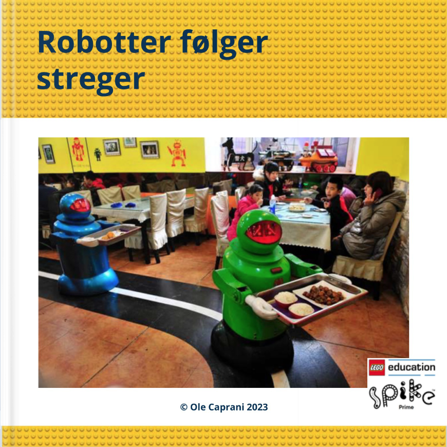
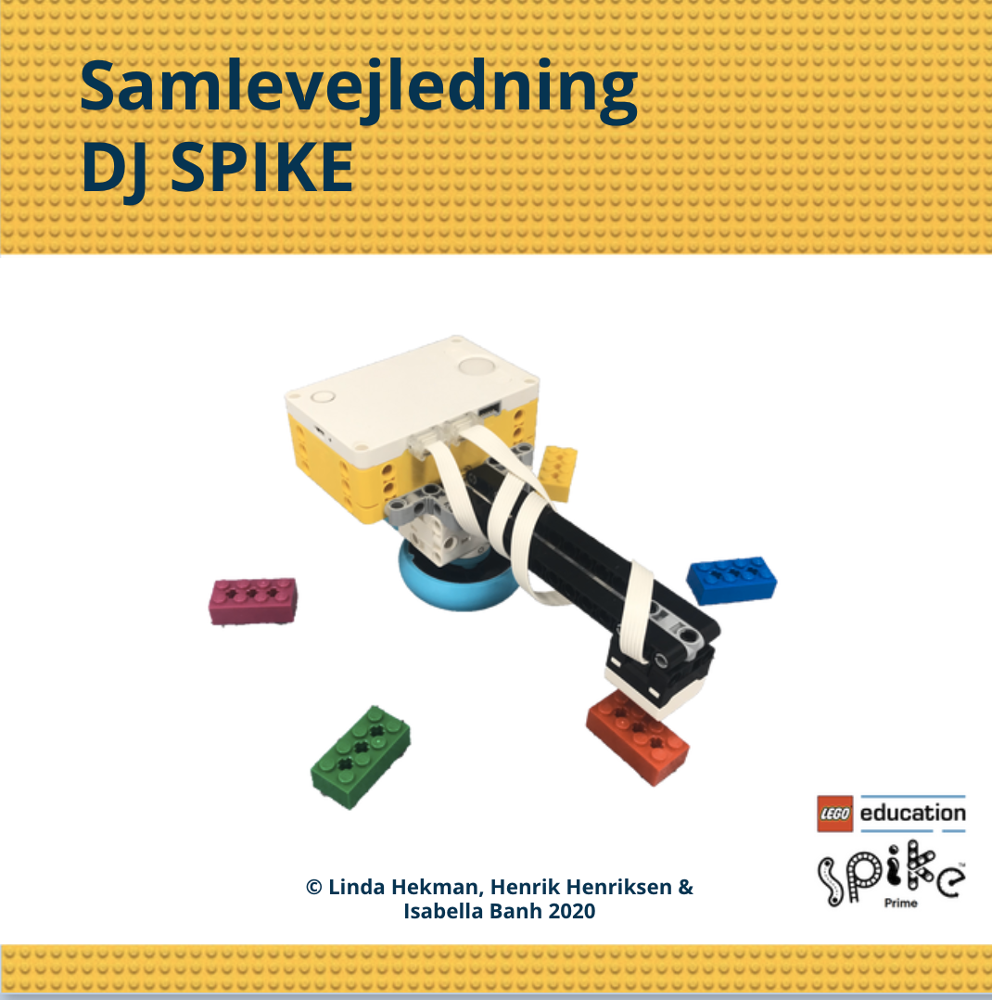
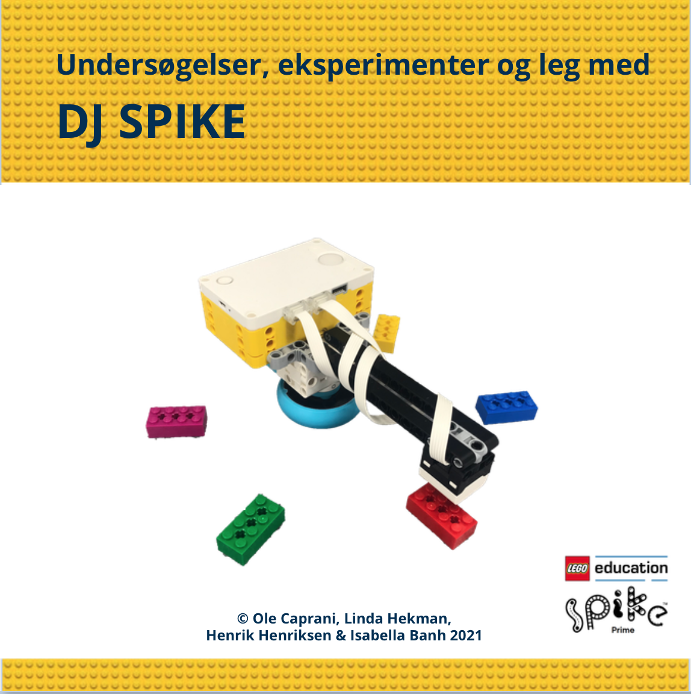
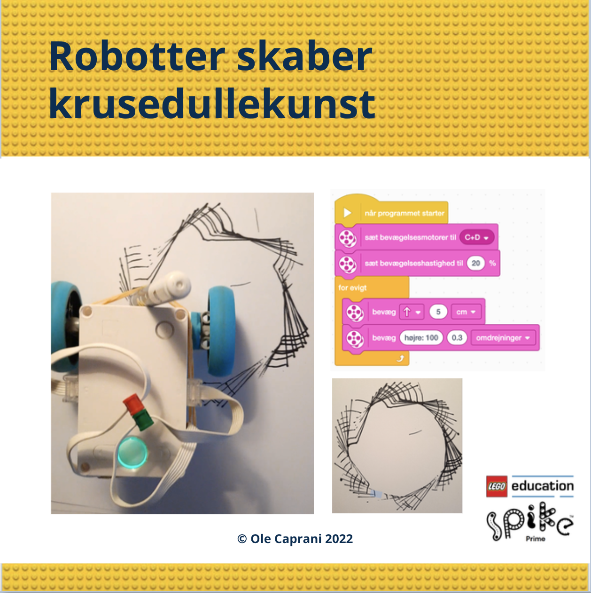

# SPIKE Prime
Bøger om blokprogrammering af LEGO modeller bygget ved brug af LEGO elementerne i <a href="https://www.lego.com/da-dk/product/lego-education-spike-prime-set-45678" target="_blank">
LEGO® Education SPIKE™ Prime-sæt 45678</a>.
Tryk på bogen for at læse den i Skoletube. For nogle bøger er der ved siden af bogens forside en liste af blokprogrammer brugt i bogen. Tryk på programmerne for at downloade dem til brug i 
<a href="https://education.lego.com/da-dk/downloads/spike-app/software/" target="_blank">SPIKE App</a>.
<table>
  <tr>
    <td>
      </td>
    <td>
      <a href="https://ocaprani.github.io/SPIKE Prime/FølgKant.llsp3" target="_blank" download>FølgKant.llsp3</a>  
      <a href="https://ocaprani.github.io/SPIKE Prime/FølgKantLysprocent.llsp3" target="_blank" download>FølgKantLysprocent.llsp3</a> 
      <a href="https://ocaprani.github.io/SPIKE Prime/FølgKantPreg.llsp3" target="_blank" download>FølgKantPreg.llsp3</a> 
      <a href="https://ocaprani.github.io/SPIKE Prime/FølgKantPregData.llsp3" target="_blank" download>FølgKantPregData.llsp3</a> 
      <a href="https://ocaprani.github.io/SPIKE Prime/FølgKantPDreg.llsp3" target="_blank" download>FølgKantPDreg.llsp3</a> 
    </td>
  </tr>
  <tr>
    <td>
      
    </td>
    <td>
      
    </td>
    <td>
      <a href="https://ocaprani.github.io/SPIKE Prime/DJSPIKE/Toner.llsp3" target="_blank" download>Toner.llsp3</a>  
      <a href="https://ocaprani.github.io/SPIKE Prime/DJSPIKE/Trin 1.llsp3" target="_blank" download>Trin 1.llsp3</a> 
      <a href="https://ocaprani.github.io/SPIKE Prime/DJSPIKE/Trin 2.llsp3" target="_blank" download>Trin 2.llsp3</a> 
      <a href="https://ocaprani.github.io/SPIKE Prime/DJSPIKE/Trin 3.llsp3" target="_blank" download>Trin 3.llsp3</a> 
      <a href="https://ocaprani.github.io/SPIKE Prime/DJSPIKE/Trin 4 Pentaton.llsp3" target="_blank" download>Trin 4 Pentaton.llsp3</a> 
      <a href="https://ocaprani.github.io/SPIKE Prime/DJSPIKE/Trin 5 Burp Lyde.llsp3" target="_blank" download>Trin 5 Burp Lyde.llsp3</a> 
      <a href="https://ocaprani.github.io/SPIKE Prime/DJSPIKE/Lydbil1.llsp3" target="_blank" download>Lydbil1.llsp3</a> 
      <a href="https://ocaprani.github.io/SPIKE Prime/DJSPIKE/Lydbil2.llsp3" target="_blank" download>Lydbil2.llsp3</a> 
    </td>
    <tr>
        <td>
      
        </td>
    </tr>
  </tr>
</table>
