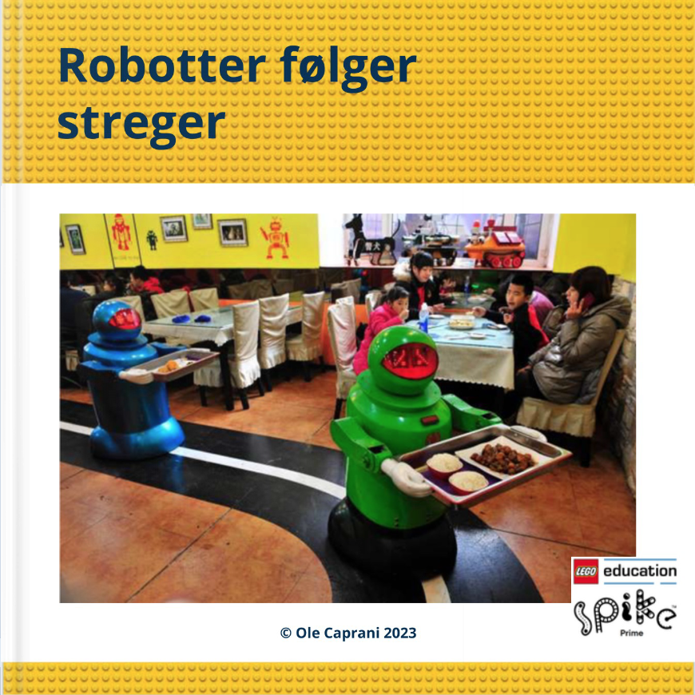

# SPIKE Prime
Bøger om blokprogrammering af LEGO modeller bygget ved brug af LEGO elementerne i <a href="https://www.lego.com/da-dk/product/lego-education-spike-prime-set-45678" target="_blank">
LEGO® Education SPIKE™ Prime-sæt 45678</a>.
Tryk på bogen for at læse den i Skoletube. Ved siden af bogens forside findes en liste af blokprogrammer brugt i bogen. Tryk på programmerne for at downloade dem til brug i 
<a href="https://education.lego.com/da-dk/downloads/spike-app/software/" target="_blank">SPIKE App</a>.
<table>
  <tr>
    <td>
      </td>
    <td>
      <a href="https://ocaprani.github.io/SPIKE/FølgKant.llsp3" target="_blank" download>FølgKant.llsp3</a>  
      <a href="https://ocaprani.github.io/SPIKE/FølgKantLysprocent.llsp3" target="_blank" download>FølgKantLysprocent.llsp3</a> 
      <a href="https://ocaprani.github.io/SPIKE/FølgKantPreg.llsp3" target="_blank" download>FølgKantPreg.llsp3</a> 
      <a href="https://ocaprani.github.io/SPIKE/FølgKantPregData.llsp3" target="_blank" download>FølgKantPregData.llsp3</a> 
    </td>
  </tr>
</table>
