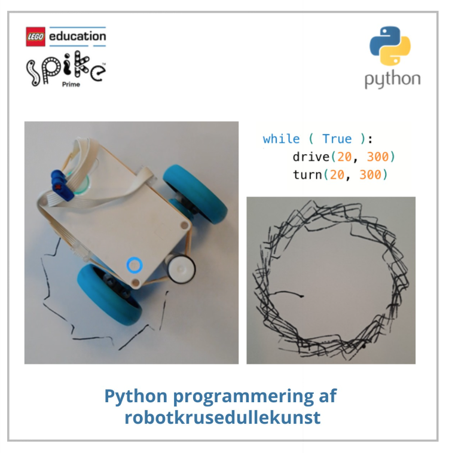
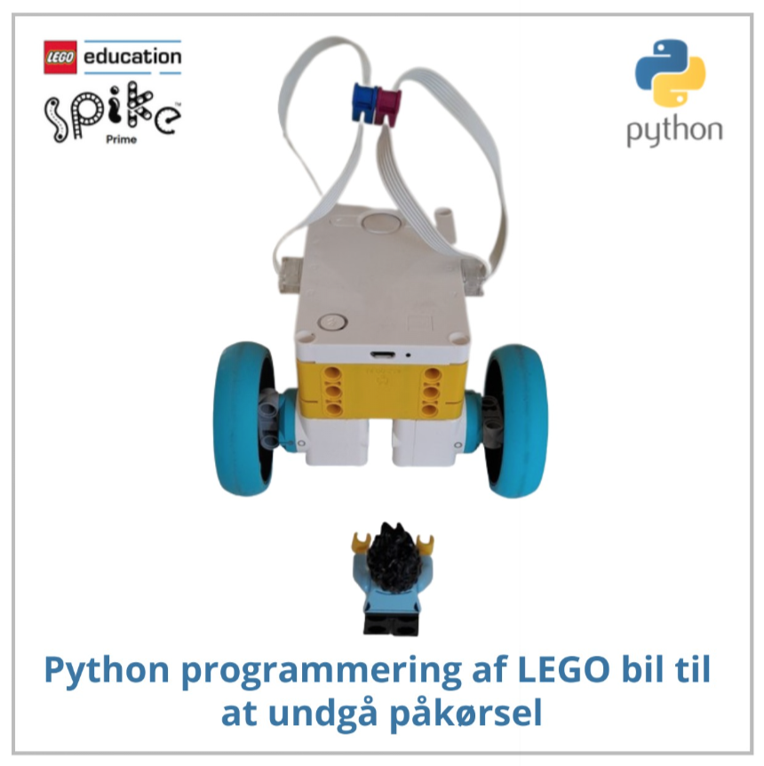
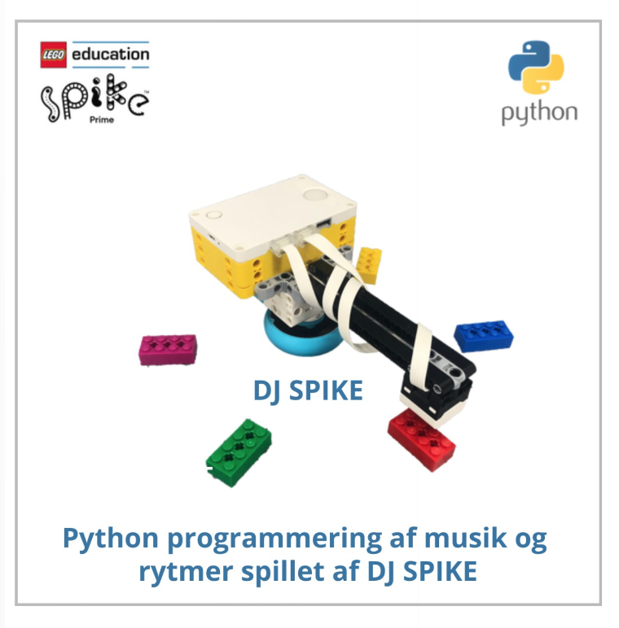
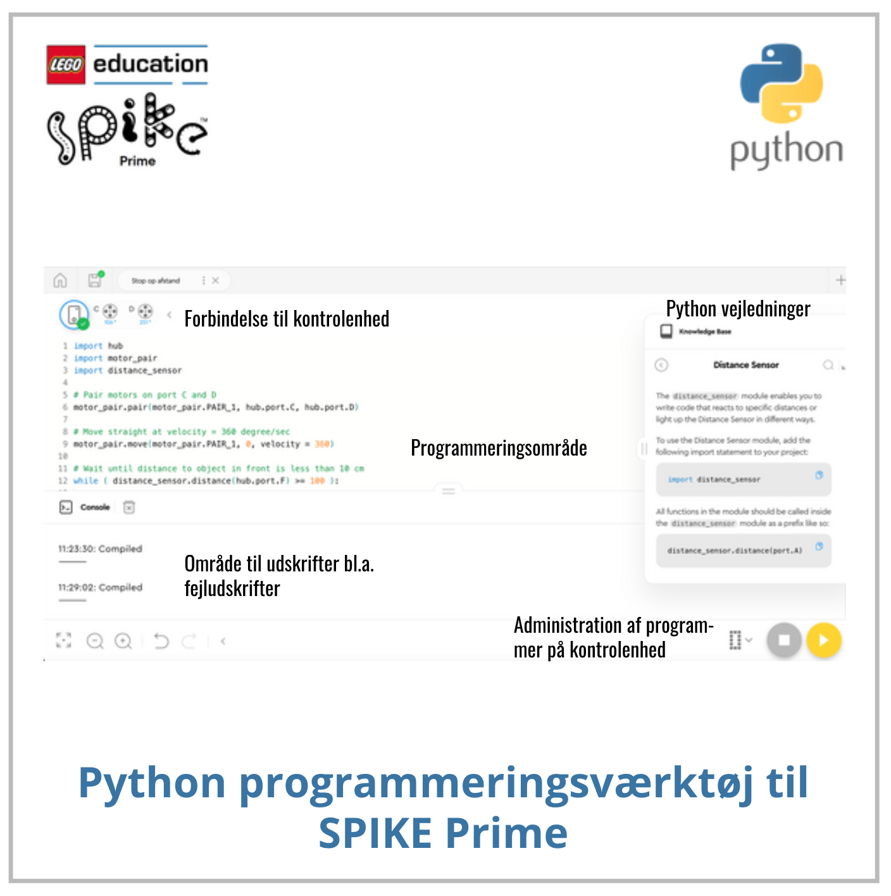

# SPIKE Python
Bøger om <a href="https://www.python.org/" target="_blank">Python</a> programmering af LEGO modeller bygget ved brug af LEGO elementerne i <a href="https://www.lego.com/da-dk/product/lego-education-spike-prime-set-45678" target="_blank">
LEGO® Education SPIKE™ Prime-sæt 45678</a>.
Tryk på bogen for at læse den i Skoletube. Ved siden af bogens forside findes en liste af Python programmer brugt i bogen. Tryk på programmerne for at downloade dem til brug i 
<a href="https://education.lego.com/da-dk/downloads/spike-app/software/" target="_blank">SPIKE App</a>.
<table>
  <tr>
    <td></td>
    <td><a href="https://ocaprani.github.io/SPIKEPython/Tegning 1.llsp3" target="_blank">Tegning 1.llsp3</a> 
        <a href="https://ocaprani.github.io/SPIKEPython/Tegning 2.llsp3" target="_blank">Tegning 2.llsp3</a> 
        <a href="https://ocaprani.github.io/SPIKEPython/Tegning 3.llsp3" target="_blank">Tegning 3.llsp3</a> 
        <a href="https://ocaprani.github.io/SPIKEPython/Tegning 4.llsp3" target="_blank">Tegning 4.llsp3</a> 
    </td>
    <td></td>
    <td><a href="https://ocaprani.github.io/SPIKEPython/Stop op tid.llsp3" target="_blank">Stop op tid.llsp3</a> 
        <a href="https://ocaprani.github.io/SPIKEPython/Stop op afstand.llsp3" target="_blank">Stop op afstand.llsp3</a> 
        <a href="https://ocaprani.github.io/SPIKEPython/Stop op gradvist.llsp3" target="_blank">Stop op gradvist.llsp3</a> 
        <a href="https://ocaprani.github.io/SPIKEPython/Stop op Preg.llsp3" target="_blank">Stop op Preg.llsp3</a> 
        <a href="https://ocaprani.github.io/SPIKEPython/Hold afstand.llsp3" target="_blank">Hold afstand.llsp3</a> 
    </td>
  </tr>
  
  <tr>
    <td></td>
    <td><a href="https://ocaprani.github.io/SPIKEPython/Trin 1.llsp3" target="_blank">Trin 1.llsp3</a> 
        <a href="https://ocaprani.github.io/SPIKEPython/Trin 2.llsp3" target="_blank">Trin 2.llsp3</a> 
        <a href="https://ocaprani.github.io/SPIKEPython/Trin 2 random frequencies.llsp3" target="_blank">Trin 2 random frequencies.llsp3</a> 
        <a href="https://ocaprani.github.io/SPIKEPython/Trin 3.llsp3" target="_blank">Trin 3.llsp3</a> 
        <a href="https://ocaprani.github.io/SPIKEPython/Trin 4.llsp3" target="_blank">Trin 4.llsp3</a> 
    </td>
  </tr>

  <tr>
    <td></td>
  </tr>
</table>
